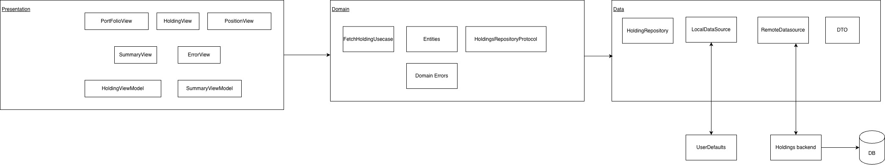

**Portfolio App (iOS)**
An iOS application that displays a user’s stock holdings with summary metrics such as total investment, current value, profit & loss, and day’s P&L.
The app follows a clean, modular architecture with offline support and high test coverage.

**Features**
	•	Holdings list with per-stock P&L
	•	Expandable summary drawer (Total Invested, Current Value, P&L, Day P&L)
	•	Pull data from remote API with local cache fallback
	•	Offline & server-error resilience
	• Extensive unit test coverage
	•	Modern UIKit UI with animated bottom summary view

**Design Considerations**
  	1. Used MVVM + Clean architecture for seperation of concerns and better testability.
   	2. Used Dependency Injection principle to pass the service dependency.
    3. Used enums, struct and protocols wherever needed.
   	5. Developed the complete UI programatically using UIKit.

**HLD**
    
	
**Next Steps** 
1. Pull to refresh
2. Search/Sort funtionality

